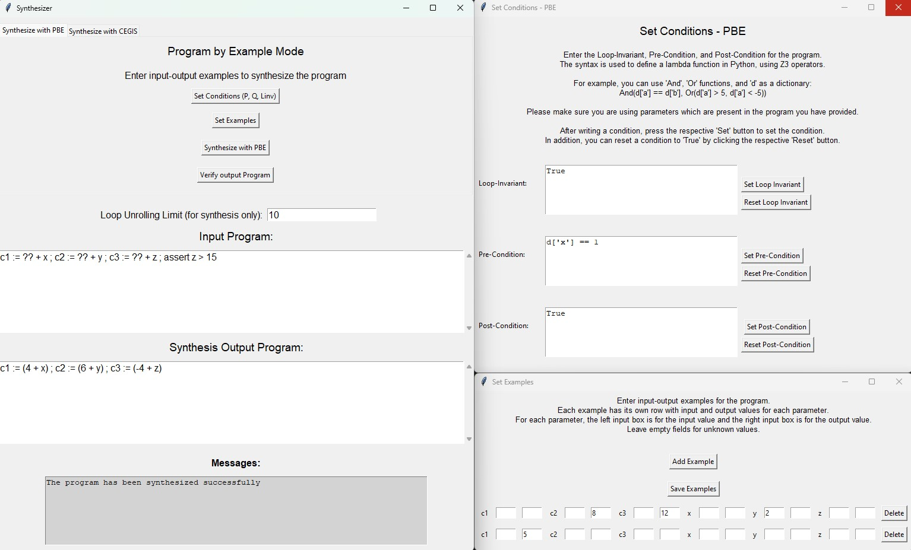

# SynthGUI
<a id="readme-top"></a>

## **Table of Contents**

1. [Introduction](#introduction)
2. [Features](#Features)
3. [Usage](#usage)
    - [General GUI Description](#general-gui-description)
    - [Set Conditions Window](#Set-Conditions-Window)
    - [Set Examples Window](#Set-Examples-Window)
    - [PBE Simple Example](#PBE-Simple-Example)
    - [CEGIS Synthesizer](#CEGIS-Synthesizer)
    - [CEGIS Interactive Mode](#CEGIS-Interactive-Mode)
4. [Interesting Cases](#Interesting-Cases)
    - [Playing With Unroll Limit](#Playing-With-Unroll-Limit)
    - [Diverging & Unrealizable Programs](#Diverging-&-Unrealizable-Programs)

---

## **Introduction**

SynthGUI is a graphical user interface for synthesizing programs using PBE (Programming by Examples) and CEGIS (Counterexample-Guided Inductive Synthesis) approaches.
This project is built using Python.
The programs synthesized by SynthGUI follow the syntax of the WhileLang language.

<p align="right">(<a href="#readme-top">back to top</a>)</p>

## **Features**

- **Synthesis with PBE (Programming By Examples)**:
This feature allows you to synthesize programs by providing examples for inputs and outputs. The synthesizer will generate a program that matches the given examples.

- **Synthesis with CEGIS (Counterexample Guided Inductive Synthesis)**:
This feature uses the CEGIS approach to synthesize programs. It iteratively refines the program by generating counterexamples and updating the program to handle them.

- **Assertions**:
Assertions are used to specify properties that the synthesized program must satisfy. These assertions are part of the syntax of the programs provided by the user.
The synthesizer will generate a program that meets these assertions, ensuring that the synthesized program behaves as expected according to the specified properties.

- **Loops Handling in Synthesis**:
This feature handles loops in the synthesis process by unrolling loops. Loop unrolling helps in dealing with loops by expanding them into a sequence of repeated statements.

- **Interactive Mode for Step-by-Step Synthesis (CEGIS only)**:
Interactive mode allows you to step through the synthesis process interactively. This is useful for learning puposes, and understanding how the CEGIS approach works.

- **Tooltip Support for Better User Guidance**:
Tooltips provide additional information about various elements in the GUI. They appear when hovering over an element, helping users understand the functionality of different components. If you are not sure about the purpose of an element in the GUI, try to hover over it, or over its label.

<p align="right">(<a href="#readme-top">back to top</a>)</p>

## **Usage**

### **Running The GUI**:
To run the GUI, execute the following command:
```sh
python WhileLang/SynthGUI.py
```

### **Running The Tests**:
To run the PBE tests, execute the following command:
```sh
python WhileLang/Tests.py pbe
```
To run the CEGIS tests, execute the following command:
```sh
python WhileLang/Tests.py cegis
```

<p align="right">(<a href="#readme-top">back to top</a>)</p>

### **General GUI Description**:


  On the top of the main screen you will see 2 different tabs:
1. Synthesize with PBE
2. Synthesize with CEGIS

  You may select which synthesizer you want to use at any time.
  the PBE tab is selected by default.

  In addition, you will find the following differents elements:
<ol start="3">
<li><strong><em>Set conditions button (P, Q, Linv)</em></strong> - Opens a new window to set pre\post-conditions, and loop invariant.</li>
<li><strong><em>Set examples button</em></strong> (PBE synthesizer only) - Opens a window where you can set input-output examples.</li>
<li><strong><em>Senthesize button</em></strong> - Synthesize the given program.</li>
<li><strong><em>Verify output program button</em></strong> - Use it to verify the output program.</li>
<li><strong><em>Loop unrolling limit box</em></strong> - Sets the value of how many times the synthesizer should unroll a loop (10 by default).</li>
<li><strong><em>Input program text box</em></strong> - Here you may enter the program you want to synthesize.</li>
<li><strong><em>Output program box</em></strong> - Shows the synthesized program. This program can be verified by pressing the 'Verify output program' button.</li>
<li><strong><em>Messages box</em></strong> - Shows all kinds of messages related to the synthesis process, and errors.</li>
<li><strong><em>Interactive checkbox</em></strong> (CEGIS synthesizer only) - Opens a window where you can step through the CEGIS process.</li>
</ol>

<p align="right">(<a href="#readme-top">back to top</a>)</p>

### **Set Conditions Window**:

  For both PBE and CEGIS, you can enter pre/post conditions, and a loop invariant.
  To enter this window, press the 'Set Conditions' button, and the following window will pop up:


  For each condition, you may enter a string which should contain a body of a Python lambda function,
  with a parameter 'd' that represents a dictionary.
  You may use the z3-solver library operators.

  For example, you can use 'And', 'Or' operators, and 'd' as a dictionary:
```sh
And(d['a'] == d['b'], Or(d['a'] > 5, d['a'] < -5))
```

  Please make sure to use parameters which are present in the program you have provided.
  After writing a condition, press the respective 'Set' button to set the condition.
  In addition, you can reset a condition to 'True' by clicking the respective 'Reset' button.

<p align="right">(<a href="#readme-top">back to top</a>)</p>

### **Set Examples Window**:

  For PBE synthesizer, you may enter some input-output examples for the provided program variables.
  To open this window, press the 'Set Examples' button.
  Before opening this window, a valid program may be provided in the 'Input Program' box.
  The tool will automatically detect the program variables and will create a convenient environment for you to set the examples.
  For example, for the following program:
```sh
c1 := ?? + x ; c2 := ?? + y ; c3 := ?? + z 
```
  Opening the examples window will result the following setup:
  


  Use the 'Add Example' to create new IO example.
  Each example represented as one row.
  For each example, you can set different IO for the different variables.
  For each variable, the left input box is for the input value, and the right input box is for the output value.
  Be sure to press the 'Save Examples' button after you set the examples.
  If you want to delete an example, press the 'Delete' button near the example you want to delete.

<p align="right">(<a href="#readme-top">back to top</a>)</p>

### **PBE Simple Example**:

  Here is an example for synthesizing a simple program with PBE, assertions, Pre-condition and 2 different IO examples:



<p align="right">(<a href="#readme-top">back to top</a>)</p>

### **CEGIS Synthesizer**:

  In CEGIS it is possible to synthesize a program without any input-output examples.
  The synthesizing process depends only on pre\post conditions, and assertions, using the CEGIS algorithm.

  <p align="right">(<a href="#readme-top">back to top</a>)</p>

### **CEGIS Interactive Mode**:
 
 Another feature we have implemented is an interactive mode for CEGIS, where you can step through the process of the CEGIS algorithm.
 This feature is for learning purposes and you are more then welcome to try it out.
 To enter this mode, check the 'Interactive' checkbox before clicking the 'Synthesize' button.
 another window will open, where you can inspect of the different specifications of the algorithm:

 1. <strong><em>States</em></strong> - Shows the different states of the algorithm, the current state is highlighted in blue.
 2. <strong><em>State Description</em></strong> - A description for each state.
 3. <strong><em>Excluded holes combinations</em></strong> - Shows a list of previous combinations of holes assignments, which led into a verification failure.
    This assignments are used by the algorithm, when finding new holes assignements.
 4. <strong><em>Current holes values</em></strong> - Shows the current holes assignemnt.
 5. <strong><em>Current program</em></strong> - Shows the current program in the synthesis process. It may contain holes ('??') or assigned holes.
 6. <strong><em>Holes program</em></strong> - Shows the given program after replacing the holes ('??') with holes variables. the variables names are 'holes_x', where x is a number.
 7. <strong><em>Messages</em></strong> - Show different messages and error which are generated after a step has been executed.
 8. <strong><em>Next step button</em></strong> - execute the current state.
 9. <strong><em>Abort button</em></strong> - abort the process and closes the interactive window.

 **You can hover the lables of each element to see a description of its purposes.**

 

<p align="right">(<a href="#readme-top">back to top</a>)</p>

## **Interesting Cases**

### **Playing With Unroll Limit**:

 When unrolling loops, we can sometimes run into cases where the synthesizer outputs different results for the same program.
 Here, we are going to demonstrate some of this cases, and analayze the different possibilities.

 Lets examine the following program:
```sh
y := 0 ; x := 0 ; t := ?? ; while x < t do ( y := y + ?? ; x := x + ??) ; assert y = 6 
```

 Now, lets give the holes some names:
```sh
y := 0 ; x := 0 ; t := hole_t ; while x < t do ( y := y + hole_y ; x := x + hole_x) ; assert y = 6 
```

 We know that the final result of 'y' should be 6.
 There are actually infinite solutions to this problem, for example:
 let hole_y be 1. we can set hole_x and hole_t to any values which satisfy the following condition: 
```sh
hole_t = 6 * hole_x, hole_x > 0
```

 This way, we have infinite number of solutions which satisfy the post condition: y = 6.
 For this reason, we might want to set some boundaries for the holes - so we can analayze what we can get and how the synthesizer might react:
```sh
y := 0 ; x := 0 ; t := ?? ; while x < t do ( y := y + ?? ; x := x + ??) ; assert y = 6 ; assert x <= 6 ; assert x >= 0 ; assert t <= 6
```

 This way we have a finite number of solutions, here they are:
```sh
y := 0 ; x := 0 ; t := 1 ; while x < t do ( y := y + 6 ; x := x + 1)
y := 0 ; x := 0 ; t := 2 ; while x < t do ( y := y + 3 ; x := x + 1)
y := 0 ; x := 0 ; t := 3 ; while x < t do ( y := y + 2 ; x := x + 1)
y := 0 ; x := 0 ; t := 6 ; while x < t do ( y := y + 1 ; x := x + 1)

y := 0 ; x := 0 ; t := 1 ; while x < t do ( y := y + 6 ; x := x + 2)
y := 0 ; x := 0 ; t := 2 ; while x < t do ( y := y + 6 ; x := x + 2)
y := 0 ; x := 0 ; t := 3 ; while x < t do ( y := y + 3 ; x := x + 2)
y := 0 ; x := 0 ; t := 4 ; while x < t do ( y := y + 3 ; x := x + 2)
y := 0 ; x := 0 ; t := 5 ; while x < t do ( y := y + 2 ; x := x + 2)
y := 0 ; x := 0 ; t := 6 ; while x < t do ( y := y + 2 ; x := x + 2)

y := 0 ; x := 0 ; t := 1 ; while x < t do ( y := y + 6 ; x := x + 3)
y := 0 ; x := 0 ; t := 2 ; while x < t do ( y := y + 6 ; x := x + 3)
y := 0 ; x := 0 ; t := 3 ; while x < t do ( y := y + 6 ; x := x + 3)
y := 0 ; x := 0 ; t := 4 ; while x < t do ( y := y + 3 ; x := x + 3)
y := 0 ; x := 0 ; t := 5 ; while x < t do ( y := y + 3 ; x := x + 3)
y := 0 ; x := 0 ; t := 6 ; while x < t do ( y := y + 3 ; x := x + 3)

y := 0 ; x := 0 ; t := 1 ; while x < t do ( y := y + 6 ; x := x + 4)
y := 0 ; x := 0 ; t := 2 ; while x < t do ( y := y + 6 ; x := x + 4)
y := 0 ; x := 0 ; t := 3 ; while x < t do ( y := y + 6 ; x := x + 4)
y := 0 ; x := 0 ; t := 4 ; while x < t do ( y := y + 6 ; x := x + 4)
y := 0 ; x := 0 ; t := 5 ; while x < t do ( y := y + 3 ; x := x + 4)
y := 0 ; x := 0 ; t := 6 ; while x < t do ( y := y + 3 ; x := x + 4)

y := 0 ; x := 0 ; t := 1 ; while x < t do ( y := y + 6 ; x := x + 5)
y := 0 ; x := 0 ; t := 2 ; while x < t do ( y := y + 6 ; x := x + 5)
y := 0 ; x := 0 ; t := 3 ; while x < t do ( y := y + 6 ; x := x + 5)
y := 0 ; x := 0 ; t := 4 ; while x < t do ( y := y + 6 ; x := x + 5)
y := 0 ; x := 0 ; t := 5 ; while x < t do ( y := y + 6 ; x := x + 5)
y := 0 ; x := 0 ; t := 6 ; while x < t do ( y := y + 3 ; x := x + 5)

y := 0 ; x := 0 ; t := 1 ; while x < t do ( y := y + 6 ; x := x + 6)
y := 0 ; x := 0 ; t := 2 ; while x < t do ( y := y + 6 ; x := x + 6)
y := 0 ; x := 0 ; t := 3 ; while x < t do ( y := y + 6 ; x := x + 6)
y := 0 ; x := 0 ; t := 4 ; while x < t do ( y := y + 6 ; x := x + 6)
y := 0 ; x := 0 ; t := 5 ; while x < t do ( y := y + 6 ; x := x + 6)
y := 0 ; x := 0 ; t := 6 ; while x < t do ( y := y + 6 ; x := x + 6)
```

 For the synthesizer to output one of this solutions, its enough to set the unroll limit to be 6.
 But, if we set the unroll limit to less than that, the number of solution decreases.
 For example, if we set the unroll limit to 1, then the program is equivalent to the following program:
```sh
y := 0 ; x := 0 ; t := hole_t ; if x < t then ( y := y + hole_y ; x := x + hole_x) else skip ; assert x >= t ; assert y = 6 ; assert x <= 6 ; assert x >= 0 ; assert t <= 6
```

**Notice that we have added another assertion after the 'skip' statement, which ensures that the 'while' condition doesn't hold when it's done.**
 Anyway, for this program, it's easy to see that hole_y has to be filled with 6.
 As for hole_t and hole_x, here are the possible solutions:
```sh
y := 0 ; x := 0 ; t := 1 ; while x < t do ( y := y + 6 ; x := x + 1)

y := 0 ; x := 0 ; t := 1 ; while x < t do ( y := y + 6 ; x := x + 2)
y := 0 ; x := 0 ; t := 2 ; while x < t do ( y := y + 6 ; x := x + 2)

y := 0 ; x := 0 ; t := 1 ; while x < t do ( y := y + 6 ; x := x + 3)
y := 0 ; x := 0 ; t := 2 ; while x < t do ( y := y + 6 ; x := x + 3)
y := 0 ; x := 0 ; t := 3 ; while x < t do ( y := y + 6 ; x := x + 3)

y := 0 ; x := 0 ; t := 1 ; while x < t do ( y := y + 6 ; x := x + 4)
y := 0 ; x := 0 ; t := 2 ; while x < t do ( y := y + 6 ; x := x + 4)
y := 0 ; x := 0 ; t := 3 ; while x < t do ( y := y + 6 ; x := x + 4)
y := 0 ; x := 0 ; t := 4 ; while x < t do ( y := y + 6 ; x := x + 4)

y := 0 ; x := 0 ; t := 1 ; while x < t do ( y := y + 6 ; x := x + 5)
y := 0 ; x := 0 ; t := 2 ; while x < t do ( y := y + 6 ; x := x + 5)
y := 0 ; x := 0 ; t := 3 ; while x < t do ( y := y + 6 ; x := x + 5)
y := 0 ; x := 0 ; t := 4 ; while x < t do ( y := y + 6 ; x := x + 5)
y := 0 ; x := 0 ; t := 5 ; while x < t do ( y := y + 6 ; x := x + 5)

y := 0 ; x := 0 ; t := 1 ; while x < t do ( y := y + 6 ; x := x + 6)
y := 0 ; x := 0 ; t := 2 ; while x < t do ( y := y + 6 ; x := x + 6)
y := 0 ; x := 0 ; t := 3 ; while x < t do ( y := y + 6 ; x := x + 6)
y := 0 ; x := 0 ; t := 4 ; while x < t do ( y := y + 6 ; x := x + 6)
y := 0 ; x := 0 ; t := 5 ; while x < t do ( y := y + 6 ; x := x + 6)
y := 0 ; x := 0 ; t := 6 ; while x < t do ( y := y + 6 ; x := x + 6)
```
 
 Although we have less results to get, there are still quite amount of them,
 and we can get one of them with less time of synthesis because we have unrolled the loop only once.

 The above analysis gives us several insights regarding the act of lowering the unroll limit:
 1. When we set the unroll limit to a smaller value, the synthesizing process will be faster.
 2. We can limit the amount of loops we want to execute, which leads to a program that run faster, and still outputs a valid solution.
 3. We can use the advantage of limiting the loop amount, to get different results.
 
 In addition, its interesting that the synthesizer can give us different results, even if we don't change the unroll limit (Try the above program with unroll limit of 6).

<p align="right">(<a href="#readme-top">back to top</a>)</p>

 ### **Diverging & Unrealizable Programs**:

 The tool is indeed not perfect, an example for it is the following program:
```sh
y := x + ?? ; if y = 10 then x := 123 else x := 456 ; assert x = 456
```

 When sending this program to CEGIS synthesizer, it won't stop, because it will always find a hole assignment, which will end up leading to a counter example.
 You can try it with the interactive mode we have implemented and see :)

 Altough, when adding an assertion for bounding x, z3-solver manages to determine that the program isn't solvable quite fast:
```sh
assert x > -10000000 ; assert x < 10000000 ; y := x + ?? ; if y = 10 then x := 123 else x := 456 ; assert x = 456
```

<p align="right">(<a href="#readme-top">back to top</a>)</p>